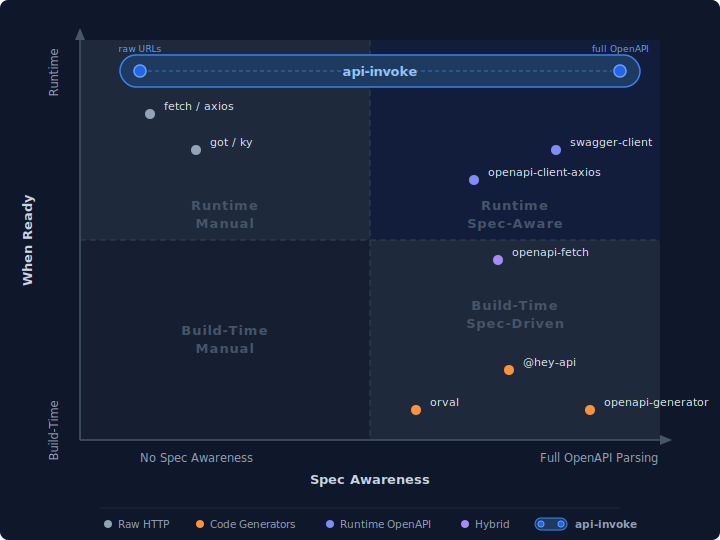

# api-invoke

**Call any REST API at runtime. No code generation. No build step.**

Give it an OpenAPI spec (v2 or v3), a raw URL, or a manually defined endpoint — `api-invoke` parses it into a uniform interface, handles authentication, builds requests, classifies errors, and executes calls. Works in Node.js and the browser.

```typescript
import { createClient } from 'api-invoke'

// Point at any OpenAPI spec → ready to call
const github = await createClient('https://api.github.com/openapi.json')
const stripe = await createClient('https://raw.githubusercontent.com/stripe/openapi/master/openapi/spec3.json')

// Or just a URL — no spec needed
const weather = await createClient('https://api.open-meteo.com/v1/forecast?latitude=40.71&longitude=-74.01')
```

## Why

Most API clients are generated at build time from a spec — you run a CLI, it spits out typed functions, and you commit the result. This works well when you know your APIs ahead of time.

But some applications need to connect to APIs they've never seen before:

- **AI agents** that discover and call APIs on behalf of users
- **API explorers and testing tools** that load any spec and let users make live calls
- **Integration platforms** that connect to customer-provided endpoints at runtime
- **Internal tooling** that needs to hit dozens of microservices without maintaining a client for each

For these cases, you need a library that can take a spec (or just a URL), understand what operations are available, and execute them — all at runtime, with no code generation step.

`api-invoke` does exactly that. It parses OpenAPI 2 (Swagger) and OpenAPI 3 specs into a spec-agnostic intermediate representation, then executes operations against the live API with built-in auth injection, error classification, middleware, and CORS handling.

## How It Compares

There are many ways to call APIs from JavaScript — from raw HTTP clients to full code generators. Here's how `api-invoke` fits into the landscape.

### Feature comparison

| Feature | fetch / axios | got / ky | openapi&#8209;generator | @hey&#8209;api | openapi&#8209;fetch | swagger&#8209;client | openapi&#8209;client&#8209;axios | **api&#8209;invoke** |
|:--------|:---:|:---:|:---:|:---:|:---:|:---:|:---:|:---:|
| No build step required | ✅ | ✅ | ❌ | ❌ | partial&nbsp;¹ | ✅ | ✅ | ✅ |
| Parses OpenAPI 3 | — | — | build | build | build&nbsp;¹ | ✅ | ✅ | ✅ |
| Parses Swagger 2 | — | — | build | build | ❌ | ✅ | ❌ | ✅ |
| Works without any spec | ✅ | ✅ | ❌ | ❌ | ❌ | ❌ | ❌ | ✅ |
| Auto-detects input type | — | — | — | — | — | ❌ | ❌ | ✅ |
| Operation discovery | ❌ | ❌ | static | static | static | ✅ | ✅ | ✅ |
| Auth injection from spec | ❌ | ❌ | generated | generated | ❌ | ✅ | ❌ | ✅ |
| Error classification | ❌ | ❌ | ❌ | ❌ | ❌ | ❌ | ❌ | ✅ |
| Built-in retry | ❌ | ✅ | — | — | ❌ | ❌ | ❌ | ✅ |
| CORS detection + proxy | ❌ | N/A | — | — | ❌ | ❌ | ❌ | ✅ |
| Middleware / hooks | interceptors | hooks | — | — | middleware | interceptors | interceptors | ✅ |
| Manual API definitions | ❌ | ❌ | ❌ | ❌ | ❌ | ❌ | ❌ | ✅ |
| Browser + Node.js | ✅ | partial&nbsp;² | N/A | N/A | ✅ | ✅ | ✅ | ✅ |
| Static TypeScript types | ❌ | ✅ | ✅ | ✅ | ✅ | ❌ | ✅ | runtime&nbsp;³ |

<sup>¹ openapi-fetch makes runtime fetch calls, but requires running openapi-typescript at build time to generate types.</sup><br/>
<sup>² got is Node-only; ky is browser-first. Neither works universally out of the box.</sup><br/>
<sup>³ api-invoke provides TypeScript types for its own API (ParsedAPI, Operation, etc.) but does not generate per-endpoint types from specs. If you know your APIs at build time, code generators give you better IntelliSense.</sup>

### Positioning

<p align="center">
  
</p>

`api-invoke` is the only tool that works across the entire top row — from raw URLs with no spec to full OpenAPI parsing, all at runtime.

### Trade-offs

We believe in being upfront about where other tools are the better choice:

- **Static types** — Code generators like [@hey-api/openapi-ts](https://github.com/hey-api/openapi-ts) and [orval](https://orval.dev/) give you full IntelliSense with endpoint-specific types. If you know your APIs at build time, they provide better TypeScript DX. `api-invoke` trades compile-time type safety for runtime flexibility.
- **OAuth flows** — `api-invoke` intentionally accepts pre-obtained tokens — it doesn't implement auth code, device, or client-credentials flows. Platforms like [Composio](https://composio.dev/) and [Superface](https://superface.ai/) handle the full OAuth lifecycle.
- **Streaming** — Not yet supported (on the [roadmap](#)). LLM streaming APIs currently need raw fetch or swagger-client.
- **Language support** — [openapi-generator](https://openapi-generator.tech/) covers 40+ languages. `api-invoke` is JavaScript/TypeScript only.
- **Managed platforms** — Tools like [Superface OneSDK](https://superface.ai/) and [Composio](https://composio.dev/) solve a different problem: managed integration platforms with pre-built connectors, auth management, and monitoring. `api-invoke` is a library you embed in your own code.

## Install

```bash
npm install api-invoke
```

## Quick Start

### From an OpenAPI spec

```typescript
import { createClient } from 'api-invoke'

const spotify = await createClient(
  'https://developer.spotify.com/_data/documentation/web-api/reference/open-api-schema.yml'
)

// Discover all available operations
console.log(spotify.operations.map(op => `${op.method} ${op.path}`))
// ['GET /albums/{id}', 'GET /artists/{id}', 'GET /search', ...]

// Authenticate and execute
spotify.setAuth({ type: 'bearer', token: process.env.SPOTIFY_TOKEN })

const result = await spotify.execute('search', {
  q: 'kind of blue',
  type: 'album',
  limit: 5,
})
console.log(result.status) // 200
console.log(result.data)   // { albums: { items: [...] } }
```

### From a raw URL (no spec)

No spec? No problem. Pass any URL and `api-invoke` creates a single `query` operation. Query parameters in the URL become configurable operation parameters with their original values as defaults.

```typescript
const weather = await createClient(
  'https://api.open-meteo.com/v1/forecast?latitude=48.85&longitude=2.35&current_weather=true'
)

// Execute with defaults from the URL
const paris = await weather.execute('query')
console.log(paris.data) // { current_weather: { temperature: 18.2, ... } }

// Override parameters
const tokyo = await weather.execute('query', {
  latitude: 35.68,
  longitude: 139.69,
})
```

### With authentication

```typescript
const client = await createClient('https://api.stripe.com/openapi/spec3.json')

// Bearer token
client.setAuth({ type: 'bearer', token: 'sk_live_...' })

// API key (header or query)
client.setAuth({ type: 'apiKey', location: 'header', name: 'X-API-Key', value: 'secret' })

// Basic auth
client.setAuth({ type: 'basic', username: 'user', password: 'pass' })

const result = await client.execute('listCustomers', { limit: 10 })
```

## Three Tiers of Usage

### Tier 1: High-level client (recommended)

`createClient` auto-detects the input type (spec URL, raw URL, or spec object) and returns a ready-to-use client.

```typescript
const client = await createClient('https://api.github.com/openapi.json')
const repos = await client.execute('listRepos', { per_page: 5 })
```

### Tier 2: Parser + executor (more control)

Use the parser and executor separately when you need to inspect or transform the parsed API before executing.

```typescript
import { parseOpenAPISpec, executeOperation } from 'api-invoke'

const api = await parseOpenAPISpec(specObject)

// Inspect operations, filter, transform...
const op = api.operations.find(o => o.id === 'getAlbum')!

const result = await executeOperation(api.baseUrl, op, { id: '4aawyAB9vmqN3uQ7FjRGTy' })
```

### Tier 3: Raw execution (zero spec)

For one-off calls where you don't have or need a spec. Still gets error classification, response parsing, and timing.

```typescript
import { executeRaw } from 'api-invoke'

const result = await executeRaw('https://api.spacexdata.com/v4/launches/latest')
console.log(result.data)      // { name: 'Crew-9', ... }
console.log(result.elapsedMs) // 142
```

## Middleware

Middleware hooks into the request/response lifecycle:

```typescript
import { createClient, withRetry, corsProxy, logging } from 'api-invoke'

const client = await createClient(specUrl, {
  middleware: [
    withRetry({ maxRetries: 3 }),
    corsProxy(),
    logging({ logger: console.log }),
  ],
})
```

### Built-in middleware

| Middleware | Description |
|---|---|
| `withRetry(options?)` | Exponential backoff with Retry-After support |
| `corsProxy(options?)` | Rewrite URLs through a CORS proxy |
| `logging(options?)` | Log requests, responses, and errors |

### Custom middleware

```typescript
import type { Middleware } from 'api-invoke'

const timing: Middleware = {
  name: 'timing',
  async onRequest(url, init) {
    console.log(`-> ${init.method} ${url}`)
    return { url, init }
  },
  async onResponse(response) {
    console.log(`<- ${response.status}`)
    return response
  },
  onError(error) {
    console.error('Request failed:', error.message)
  },
}
```

## Error Handling

Every error is an `ApiInvokeError` with a `kind` for programmatic handling, a human-readable `suggestion`, and a `retryable` flag:

```typescript
import { ApiInvokeError, ErrorKind } from 'api-invoke'

try {
  await client.execute('getUser', { id: '123' })
} catch (err) {
  if (err instanceof ApiInvokeError) {
    switch (err.kind) {
      case ErrorKind.AUTH:       // 401/403 — bad credentials or insufficient permissions
      case ErrorKind.CORS:       // Blocked by browser CORS policy
      case ErrorKind.NETWORK:    // Connection failed, DNS error, etc.
      case ErrorKind.HTTP:       // Other 4xx/5xx responses
      case ErrorKind.RATE_LIMIT: // 429 — too many requests
      case ErrorKind.TIMEOUT:    // Request timed out
      case ErrorKind.PARSE:      // Response was not valid JSON
    }
    console.log(err.suggestion) // "Check your credentials. The server rejected your authentication."
    console.log(err.retryable)  // true for network/rate-limit/timeout, false for auth/cors/parse
  }
}
```

To get error responses as data instead of exceptions:

```typescript
const result = await executeOperation(baseUrl, operation, args, {
  throwOnHttpError: false,
})
// result.status may be 404, 500, etc. — data is still parsed
```

## Execution Result

Every execution returns an `ExecutionResult`:

```typescript
interface ExecutionResult {
  status: number                                                  // HTTP status code
  data: unknown                                                   // Parsed response body
  headers: Record<string, string>                                 // Response headers
  request: { method: string; url: string; headers: Record<string, string> } // What was sent
  elapsedMs: number                                               // Round-trip time in ms
}
```

## Types

The parsed API uses spec-agnostic types that work regardless of the source format:

```typescript
import type {
  ParsedAPI,        // Parsed spec with operations, auth schemes, and metadata
  Operation,        // Single API operation (id, path, method, parameters, body)
  Parameter,        // Path, query, header, or cookie parameter with schema
  RequestBody,      // POST/PUT/PATCH body definition
  Auth,             // Authentication credentials (bearer, basic, apiKey, oauth2)
  AuthScheme,       // Auth scheme detected from the spec
  ExecutionResult,  // Response from an executed operation
  Middleware,       // Request/response interceptor
  Enricher,         // Post-parse API transformer
} from 'api-invoke'
```

## License

MIT
